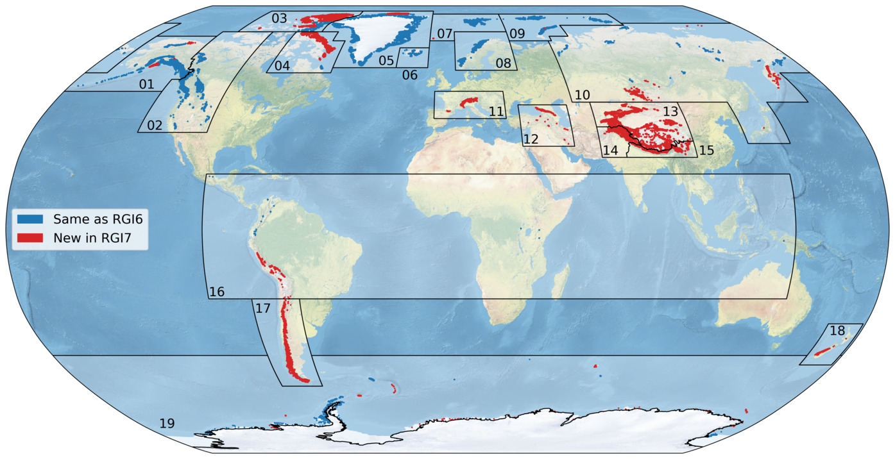

# Regional data sources

:::{figure-md} global-fig-changes

First-order regions of the Randolph Glacier Inventory (version 7.0) and glacier locations. In red, outlines which are new in RGI7. In blue, outlines which didn't change since RGI6. [Download high resolution version](https://raw.githubusercontent.com/GLIMS-RGI/user_guide/main/docs/img/global_map_wrgi6.png).
:::

- 
- 
- 
- 
