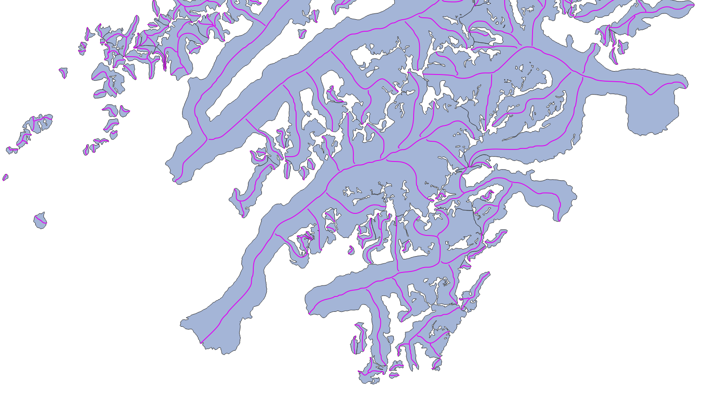

# Glacier centerlines product

**New in RGI 7.0**

The glacier centerlines products contains geometrical centerlines for the main branches and major tributaries of all glaciers in the RGI 7.0 glacier product. The centerlines are computed using a geometrical flow routing algorithm first described by {cite:t}`Kienholz2014` and implemented and executed by the Open Global Glacier Model (OGGM) {cite:p}`Maussion2019`. When using this product, we recommend to cite both publications alongside the standard RGI 7.0 citation to provide a scientific context. 

Each glacier contains one centerline along the main trunk of the glacier, as well any number of additional centerlines along tributaries, sorted according to their Strahler number (a measure of branching complexity defined by {cite:t}`Strahler1952`, see definition below). The main (i.e.longest) centerline is used to compute the glacier product's maximum length attribute `lmax_m`.

:::{figure-md} centerlines-fig

Example of the glacier centerlines product (purple) drawn over the glacier product (light blue).
:::

## Product files

In the following, file contents are explained using RGI region 01 (Alaska) as example:

`RGI2000-v7.0-L-01_alaska.shp`
: RGI glacier centerlines as a shapefile (with accompanying `.dbf`, `.prj`, `.cpg` and `.shx` files).

`RGI2000-v7.0-L-01_alaska-attributes.csv`
: Glacier centerlines attributes in a `.csv` file. The attributes are strictly the same as those encountered in the shapefile. This file allows users to read glacier attributes without reading the entire shapefile.

`RGI2000-v7.0-L-01_alaska-attributes_metadata.json`
: Information about the attributes: full name, description, units, etc.

## Full list of attributes

The following attributes are available in the RGI 7.0 shapefiles. For more details on some of them, see .

`rgi_id`
: `long_name`: RGI identifier   `description`: Unique identifier assigned to a single intersect line.   `datatype`: str   `units`:    `source`: RGI

`rgi_g_id`
: `long_name`: RGI glacier identifier   `description`: Glacier ID to which the centerline belongs.   `datatype`: str   `units`:    `source`: RGI

`segment_id`
: `long_name`: Segment identifier   `description`: Integer number uniquely identifying this centerline within the glacier. The main centerline is always last.   `datatype`: int   `units`:    `source`: RGI

`is_main`
: `long_name`: Is main centerline   `description`: Integer number indicating whether the centerline in the main centerline (1) or not (0). There is only one main centerline per glacier.   `datatype`: int   `units`:    `source`: RGI

`outflow_id`
: `long_name`: Outflow segment identifier   `description`: Each secondary centerline flows into another centerline. This identifier points to the `segment_id` to which this centerline flows to.   `datatype`: int   `units`:    `source`: RGI

`strahler_n`
: `long_name`: Strahler number of this centerline.   `description`: Strahler number (Hydrological order) of the centerline, from lowest (0, line without tributaries but with possible descendants) to highest (the main centerline).   `datatype`: int   `units`:    `source`: RGI

`length_m`
: `long_name`: Centerline length   `description`: Length of the centerline in meters.   `datatype`: int   `units`: m   `source`: RGI

`geometry`
: `long_name`: Geometry   `description`: Centerline geometry (LineString).   `datatype`:    `units`: deg   `source`: RGI

(additional-info-centerlines)=
## Additional information on centerline attributes

The centerlines and their attributes are computed by OGGM {cite:p}`Maussion2019`, which implements an algorithm described by {cite:t}`Kienholz2014`. The implementation in OGGM follows closely the description by {cite:t}`Kienholz2014`, but it is coded in a different framework and thus may lead to slightly different results (the OGGM implementation is coded entirely in python, while the original implementation relied on ArcGIS tools). Neither the original algorithm nor its implementation in OGGM are perfect, and it is likely that centerlines on individual glaciers would be drawn differently by a human or other algorithms. We note that we do not use any velocity product but rely purely on geometric and topographic considerations.

### Strahler number

The Strahler number `strahler_n` is a measure of branching complexity defined by {cite:p}`Strahler1952` commonly used in hydrological applications. A Strahler number of 0 indicates a centerline without any tributaries. A Strahler number of 1 indicates a centerline with one or more upstream tributaries of the same order, i.e. each of them having a Strahler number of 0. If a centerline with a Strahler number of 1 meets a downglacier centerline, the latter is assigned a Strahler number of 2. This ordering is important for mass flow routing. Each centerline contains a reference to its descendant, and this reference might be used by models to transfer mass from the tributaries towards the main centerline. Note that in the original concept Strahler numbers start with 1 instead of 0.

### Main centerline 

The main centerline of the glacier is the longest of all centerlines connecting the multiple glacier "heads" to one single terminus. The centerline algorithm selects potential heads by searching for local elevation maxima along the glacier outline, and then computes all the centerlines joining all heads to the terminus. The longest is selected as the main centerline, which implies that the computed glacier length is usually longer than the shortest route from the highest to the lowest point of the glacier.
