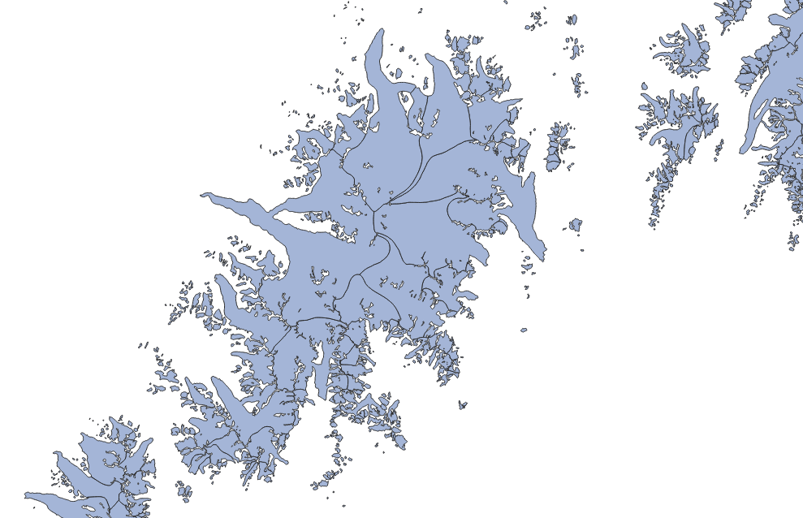

# Glacier product 

This product includes the glacier outlines as extracted from GLIMS together with additional data for each individual glacier. 

:::{figure-md} glacier-fig

Example of the glacier product (light blue), with outlines in black.
:::

## Product files

In the following, file contents are explained using RGI region 01 (Alaska) as example:

`RGI2000-v7.0-G-01_alaska.shp`
: RGI glacier outlines as a shapefile (with accompanying `.dbf`, `.prj`, `.cpg` and `.shx` files).

`RGI2000-v7.0-G-01_alaska-attributes.csv`
: Glacier attributes in a `.csv` file. The attributes are strictly the same as those encountered in the shapefile. This file allows users to read glacier attributes without reading the entire shapefile.

`RGI2000-v7.0-G-01_alaska-attributes_metadata.json`
: Information about the attributes: full name, description, units, etc.

`RGI2000-v7.0-G-01_alaska-submission_info.csv`
: Information about the data providers ordered by submission id. Each glacier outline can be attributed to a specific submission via the `subm_id` attribute.

`RGI2000-v7.0-G-01_alaska-submission_info_metadata.json`
: Information about the attributes in the submission info file: full name, description, units, etc.

`RGI2000-v7.0-G-01_alaska-rgi6_links.csv`
: A list of overlapping outline pairs between RGI 7.0 and RGI 6.0 describing 1:1, 1:n, n:1 or n:n relationships as well as the overlapping area between them. For example, a perfect match between an RGI 7.0 and RGI 6.0 outline results in a 1:1 relation with 100% area match in both. If a single RGI 6.0 outline was divided into two glaciers for RGI 7.0, a 2:1 relationship (a cluster) would result with two lines in the table with twice 50% area match in RGI 6.0 and twice 100% match in RGI 7.0. In more complex cases the matches are not always perfect and the relationships less straightforward, for example when an outline was remapped.

`RGI2000-v7.0-G-01_alaska-hypsometry.csv`
: The hypsometry table for each glacier, preceded by copies of the glacier’s `rgi_id` and `area_km2`, is a comma-separated series of elevation-band areas in the form of integer thousandths of the glacier's total area in km² (`area_km2`). The sum of the elevation-band areas is constrained to be 1000. This means that an elevation band’s value divided by 10 represents the elevation band’s area as a percentage of total glacier area. The elevation bands are all 50 m in height and their central elevations are listed in the file header record. Within each hypsometry file the elevation bands extend from the lowest glacierized elevation up to the highest glacierized elevation band of the first-order region.

## Full list of attributes

The following attributes are available in the RGI 7.0 shapefiles. For more details on some of them, see .

`rgi_id`
: `long_name`: RGI identifier   `description`: Unique identifier assigned to a single outline by the RGI   `datatype`: str   `units`:    `source`: RGI   `rgi6_name`: RGI_Id

`o1region`
: `long_name`: First order region   `description`: The code of the first-order region to which the glacier belongs.   `datatype`: str   `units`:    `source`: RGI   `rgi6_name`: O1Region

`o2region`
: `long_name`: Second order region   `description`: The code of the second-order region to which the glacier belongs.   `datatype`: str   `units`:    `source`: RGI   `rgi6_name`: O2Region

`glims_id`
: `long_name`: GLIMS identifier   `description`: Non-unique identifier assigned to glaciers by the Global Land Ice Measurements from Space service at NSIDC   `datatype`: str   `units`:    `source`: GLIMS   `rgi6_name`: GLIMS_Id

`anlys_id`
: `long_name`: Analysis identifier   `description`: The unique identifier assigned within GLIMS for a particular outline of a glacier at a particular time.   `datatype`: int   `units`:    `source`: GLIMS   `rgi6_name`: 

`subm_id`
: `long_name`: Submission identifier   `description`: Unique identifier assigned by GLIMS to a specific data submission. Allows to obtain information about the analysts and data submitters.   `datatype`: int   `units`:    `source`: GLIMS   `rgi6_name`: 

`src_date`
: `long_name`: Outline source date   `description`: The as-of date for the outline (usually the acquisition date of the image), in the format ISO 8601.   `datatype`: str   `units`: date   `source`: GLIMS   `rgi6_name`: BgnDate

`cenlon`
: `long_name`: Center longitude   `description`: Longitude of an approximately central point within the glacier outlines (not the centroid).   `datatype`: float   `units`: degrees   `source`: RGI   `rgi6_name`: CenLon

`cenlat`
: `long_name`: Center latitude   `description`: Latitude of an approximately central point within the glacier outlines (not the centroid).   `datatype`: float   `units`: degrees   `source`: RGI   `rgi6_name`: CenLat

`utm_zone`
: `long_name`: UTM zone   `description`: Number of the UTM zone for this glacier, based on its representative point. Note that this attribute is for information only, the geometries are all in WGS84.   `datatype`: int   `units`:    `source`: RGI   `rgi6_name`: 

`area_km2`
: `long_name`: Glacier area   `description`: Area of the glacier.   `datatype`: float   `units`: km2   `source`: RGI   `rgi6_name`: Area

`primeclass`
: `long_name`: Primary classification   `description`: WGMS primary classification of the glacier. For a categories description, see user guide.   `datatype`: int   `units`:    `source`: GLIMS   `rgi6_name`: 

`conn_lvl`
: `long_name`: Connectivity level   `description`: Level of connection to the Greenland Icesheet (0: no connection; 1: weak connection).   `datatype`: int   `units`:    `source`: GLIMS   `rgi6_name`: Connect

`surge_type`
: `long_name`: Evidence for surging   `description`: Flag indicating if surging behavior has been documented for this glacier. For a categories description, see user guide.   `datatype`: int   `units`:    `source`: GLIMS   `rgi6_name`: Surging

`term_type`
: `long_name`: Glacier terminus type   `description`: Flag indicating the terminus type of the glacier. For a categories description, see user guide.   `datatype`: int   `units`:    `source`: GLIMS   `rgi6_name`: TermType

`glac_name`
: `long_name`: Glacier name   `description`: Glacier name (when available).   `datatype`: str   `units`:    `source`: GLIMS   `rgi6_name`: Name

`is_rgi6`
: `long_name`: Same as RGI 6.0 outline   `description`: Flag indicating if the outline is the same as in RGI 6.0 (1) or was remapped (0). Note that it does not guarantee strict equivalence of the polygon (in most of the cases it does).   `datatype`: int   `units`:    `source`: RGI   `rgi6_name`: 

`termlon`
: `long_name`: Terminus longitude   `description`: Longitude of the lowest elevation point on the glacier outline.   `datatype`: float   `units`: degrees   `source`: RGI   `rgi6_name`: 

`termlat`
: `long_name`: Terminus latitude   `description`: Latitude of the lowest elevation point on the glacier outline.   `datatype`: float   `units`: degrees   `source`: RGI   `rgi6_name`: 

`zmin_m`
: `long_name`: Minimum elevation   `description`: Minimum elevation (m above sea level) of the glacier.   `datatype`: float   `units`: m   `source`: RGI   `rgi6_name`: Zmin

`zmax_m`
: `long_name`: Maximum elevation   `description`: Maximum elevation (m above sea level) of the glacier.   `datatype`: float   `units`: m   `source`: RGI   `rgi6_name`: Zmax

`zmed_m`
: `long_name`: Median elevation   `description`: Median elevation (m above sea level) of the glacier.   `datatype`: float   `units`: m   `source`: RGI   `rgi6_name`: Zmed

`zmean_m`
: `long_name`: Mean elevation   `description`: Mean elevation (m above sea level) of the glacier.   `datatype`: float   `units`: m   `source`: RGI   `rgi6_name`: 

`slope_deg`
: `long_name`: Mean slope   `description`: Mean slope of the glacier surface.   `datatype`: float   `units`: degrees   `source`: RGI   `rgi6_name`: Slope

`aspect_deg`
: `long_name`: Aspect   `description`: The aspect (orientation) of the glacier surface presented as an azimuth relative to 0° at due north.   `datatype`: float   `units`: degrees   `source`: RGI   `rgi6_name`: Aspect

`aspect_sec`
: `long_name`: Aspect sector   `description`: The aspect (orientation) of the glacier surface presented as a category. For a categories description, see user guide.   `datatype`: int   `units`:    `source`: RGI   `rgi6_name`: 

`dem_source`
: `long_name`: DEM data source   `description`: The name of the dataset that was used to compute the topography attributes.   `datatype`: str   `units`:    `source`: RGI   `rgi6_name`: 

`lmax_m`
: `long_name`: Maximum length   `description`: Length (m) of the longest surface centerline of the glacier.   `datatype`: int   `units`: m   `source`: RGI   `rgi6_name`: Lmax

`geometry`
: `long_name`: Geometry   `description`: Glacier geometry (polygon)   `datatype`:    `units`: deg   `source`: GLIMS   `rgi6_name`: geometry

(additional-info-glaciers)=
## Additional information on glacier attributes

### Glacier identifiers

One RGI outline in the glacier product corresponds to one glacier. Glaciers are identified with the following attributes:

`rgi_id` 
: **Unique** identifier attributed by the RGI when constructing the files. These ids are generated automatically (in order of distance to the westernmost outline in a region) and follow the file naming convention described below. **These ids are different from RGI 6.0 and likely to change in future RGI versions**.

`glims_id` 
: **Non-unique** identifier assigned to glaciers by the Global Land Ice Measurements from Space service at NSIDC. A single `glims_id` can have multiple outlines, for example at different dates or when a glacier disintegrates.

`anlys_id` 
: **Unique** identifier assigned within GLIMS for a particular outline of a glacier at a particular time and for a particular submission.  **These ids allow to unambiguously trace an outline back to the GLIMS database**, and will not change between future RGI versions if the outline does not change.

### Topography attributes 

The `zmin_m`, `zmax_m`, `zmed_m`, `zmean_m` attributes are computed from a Digital Elevation Model (DEM) reprojected onto a locally defined grid for each glacier. 
 
Each glacier grid is defined in the locally valid UTM zone (`utm_zone` attribute) and with a grid spacing $dx$ depending on the glacier size: $dx =  14 \sqrt{A} + 10$, with $dx$ the grid spacing in meters and $A$ the glacier area in km² {cite:p}`Maussion2019`. If a grid spacing chosen by this formula exceeds 100 m, the grid spacing is fixed to a maximum of 100 m. Effectively, this means that a glacier of the minimum area of 0.01 km² will have a grid spacing of 11.4 m, a 8 km² glacier a grid spacing of 50 m, and all glaciers above 42 km² a grid spacing of 100 m. The chosen DEM product (`dem_source` attribute) is reprojected onto the local glacier grid and interpolated using cubic resampling with the [rasterio](https://rasterio.readthedocs.io) library.

The main DEM product used for RGI 7.0 is the Copernicus DEM {cite:p}`Copernicus2019` (used for all but 128 glaciers). The COP-DEM products are available at 30 m and 90 m resolution. For all glaciers which grid size is below 60 m we use the 30 m COP-DEM product as source, and use the 90 m COP-DEM product for all other glaciers. If the COP-DEM product is not available for a glacier, we use one of the alternative products RAMP (21 glaciers), DEM3 (20 glaciers), ASTER (14 glaciers), or TANDEM (73 glaciers). We ask our users to refer to the original data sources in their publications if the topography attributes derived from RGI 7.0 play a significant role: refer to  for a full reference.

For each glacier, a glacier mask is computed from the outlines and then applied to compute the glacier statistics. 

### Slope attributes 

The `slope_deg`, `aspect_deg`, `aspect_sec` attributes are computed from the same DEM and grid as for the topography attributes described above. 

`slope_deg` and `aspect_deg` are computed using a standard trigonometric functions in python. The `aspect_sec` attribute contains information on the orientation of the glacier, classified into the following categories:

|   Value | Aspect sector   | Aspect range     |
|--------:|:----------------|:-----------------|
|       1 | North           | [-22.°; 22.5°]   |
|       2 | North-east      | [22.5°; 67.5°]   |
|       3 | East            | [67.5°; 112.5°]  |
|       4 | South-east      | [112.5°; 157.5°] |
|       5 | South           | [157.5°; 202.5°] |
|       6 | South-west      | [202.5; 247.5°]  |
|       7 | West            | [247.5°; 292.5°] |
|       8 | North-west      | [292.5°; 337.5°] |
|       9 | Not assigned    |                  |

### Terminus location

The `termlon`, `termlat` attributes mark the longitude and latitude of the last point of the main centerline, guaranteed to be on the glacier outline. It represents (approximately) the location of lowest elevation along the glacier outline. Knowing the terminus location is useful to assign a glacier to a hydrological basin, for example.

:::{figure-md} terminus-fig

Example of the glacier terminus location (red dots) plotted with the centerlines product (purple) drawn over the glacier product (light blue).
:::

### Glacier length 

The maximum length (`lmax_m`, in meters) is computed from the main centerline in the RGI 7.0 glacier centerline product. Absolute glacier length is a subjective measure, and principally depends on the chosen "head" of the glacier. The head is distinct from the maximum elevation of the glacier. The centerline algorithm from {cite:t}`Kienholz2014` selects potential heads by searching for local maxima along the glacier outline, and then computes all the centerlines joining all heads to the single terminus. The longest of them is selected as the main centerline, which implies that the computed glacier length is often longer than the shortest route from the highest to the lowest point of the glacier.

### Surge type

The `surge_type` attribute contains information on evidence for surging, and is based on the following datasets:

- All glaciers marked as surge-type in RGI 6.0;
- The global inventory of {cite:t}`Sevestre2015`;
- An inventory of surge-type glaciers in the Karakoram from {cite:t}`Bhambri2017` (region 14);
- An inventory of observed glacier surges in the Pamirs from {cite:t}`Goerlich2020` (region 13);
- An inventory of High Mountain Asia surge-type glaciers from {cite:t}`Guillet2022` (regions 13, 14, 15);
- Additional inventories compiled by Ruth Krembel, Andreas Kääb, and Frank Paul.

Each inventory was intersected with the RGI 7.0 outlines. For inventories with glacier outlines, intersections smaller than
5% by area were discarded. For inventories with point data, where no intersection was found, the closest glacier to the
point was manually chosen based on a comparison with the metadata provided with each inventory. Finally, each glacier 
in the RGI 7.0 was then assigned the category corresponding to the highest level of confidence based on each inventory 
(i.e., "observed" > "probable" > "possible" > "not assigned").

|   Value | Surging      |
|--------:|:-------------|
|       0 | No evidence  |
|       1 | Possible     |
|       2 | Probable     |
|       3 | Observed     |
|       9 | Not assigned |

Visit  for glacier counts/area of this attribute in RGI 7.0 and RGI 6.0.

### Terminus type

The `term_type` attribute contains information on terminus type. All glaciers in RGI 7.0 have been assigned the "Not assigned" category, except 
for the marine-terminating glaciers in the northern hemisphere (after {cite:t}`Kochtitzky2022`) and in region 17 - Southern Andes (same methodology). 

The marine-terminating `term_type` attribute is valid for approximately the year 2000. The only region missing classification for marine-terminating glaciers 
is RGI 19 (Antarctic and Subantarctic), thus all glaciers that are "not assigned" outside of RGI 19 can be assumed to be non-marine-terminating 
for approximately 2000. 

As of RGI 7.0, no region or glacier has any attributes available for lake-terminating or shelf-terminating glaciers. 
We aim to add this information in version 7.1.

 
|   Value | Terminus type      |
|--------:|:-------------------|
|       0 | Land-terminating   |
|       1 | Marine-terminating |
|       2 | Lake-terminating   |
|       3 | Shelf-terminating  |
|       9 | Not assigned       |

Visit  for glacier counts/area of this attribute in RGI 7.0 and RGI 6.0.

### WGMS primary classification 

The WGMS primary classification of the glacier (`primeclass`) is directly fetched from the GLIMS database. It is currently poorly populated, with only few submissions to GLIMS having provided this information.

|   Digit | Class                   | Description                                                                                                                                                                                                                                                                                    |
|--------:|:------------------------|:-----------------------------------------------------------------------------------------------------------------------------------------------------------------------------------------------------------------------------------------------------------------------------------------------|
|       0 | Miscellaneous           | Any type not listed below (please explain)                                                                                                                                                                                                                                                     |
|       1 | Continental ice sheet   | Inundates areas of continental size                                                                                                                                                                                                                                                            |
|       2 | Icefield                | Ice masses of sheet or blanket type of a thickness that is insufficient to obscure the subsurface topography                                                                                                                                                                                   |
|       3 | Ice cap                 | Dome-shaped ice masses with radial flow                                                                                                                                                                                                                                                        |
|       4 | Outlet glacier          | Drains an ice sheet, icefield or ice cap, usually of valley glacier form; the catchment area may not be easily defined                                                                                                                                                                         |
|       5 | Valley glacier          | Flows down a valley; the catchment area is well defined                                                                                                                                                                                                                                        |
|       6 | Mountain glacier        | Cirque, niche or crater type, hanging glacier; includes ice aprons and groups of small units                                                                                                                                                                                                   |
|       7 | Glacieret and snowfield | Small ice masses of indefinite shape in hollows, river beds and on protected slopes, which has developed from snow drifting, avalanching, and/or particularly heavy accumulation in certain years; usually no marked flow pattern is visible; in existence for at least two consecutive years. |
|       8 | Ice shelf               | Floating ice sheet of considerable thickness attached to a coast nourished by a glacier(s); snow accumulation on its surface or bottom freezing                                                                                                                                                |
|       9 | Rock glacier            | Lava-stream-like debris mass containing ice in several possible forms and moving slowly downslope

## Submission info table

Each glacier region folder contains a csv file containing information about provenance of the glacier outlines. This file is available for the glacier product only, and allows to associate each outline's `subm_id` (submission identifier) to a specific entry in the GLIMS database. The table contains the following columns:

`subm_id`
: `long_name`: submission_id   `description`: Unique identifier assigned by GLIMS to a specific data submission. Allows to obtain information about the analysts and data submitters.   `datatype`: int   `units`:    `source`: GLIMS   `rgi6_name`: 

`n_outlines`
: `long_name`: number_of_outlines   `description`: Number of outlines from this submission used in RGI 7.0.   `datatype`: int   `units`:    `source`: RGI   `rgi6_name`: 

`area_km2`
: `long_name`: total_area_of_outlines   `description`: Total area of the outlines from this submission used in RGI 7.0.   `datatype`: float   `units`: km2   `source`: RGI   `rgi6_name`: 

`anlys_time`
: `long_name`: analysis_time   `description`: Representative time the outline analysis was carried out.   `datatype`: str   `units`: date   `source`: GLIMS   `rgi6_name`: 

`release_dt`
: `long_name`: release_date   `description`: Date at which the submission was realeased on GLIMS.   `datatype`: str   `units`: date   `source`: GLIMS   `rgi6_name`: 

`proc_desc`
: `long_name`: processing_description   `description`: Description of the processing done to create the glacier outlines.   `datatype`: str   `units`:    `source`: GLIMS   `rgi6_name`: 

`chief_affl`
: `long_name`: chief_affiliation   `description`: Affiliation of the chief of the regional center or the person(s) who submitted the data.   `datatype`: str   `units`:    `source`: GLIMS   `rgi6_name`: 

`submitters`
: `long_name`: submitters   `description`: Person(s) who submitted the data.   `datatype`: str   `units`:    `source`: GLIMS   `rgi6_name`: 

`analysts`
: `long_name`: analysts   `description`: Person(s) who created the data.   `datatype`: str   `units`:    `source`: GLIMS   `rgi6_name`: 

`rc_id`
: `long_name`: regional_center_id   `description`: GLIMS ID for the regional center.   `datatype`: int   `units`:    `source`: GLIMS   `rgi6_name`: 
