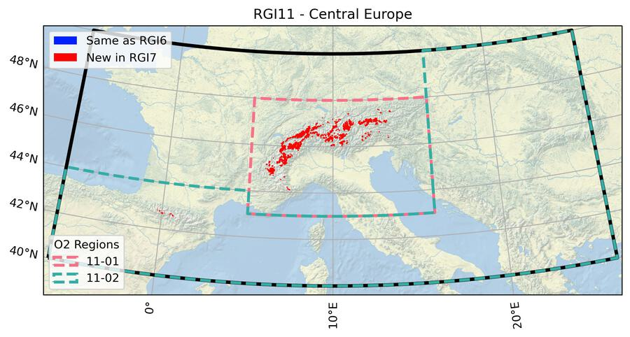
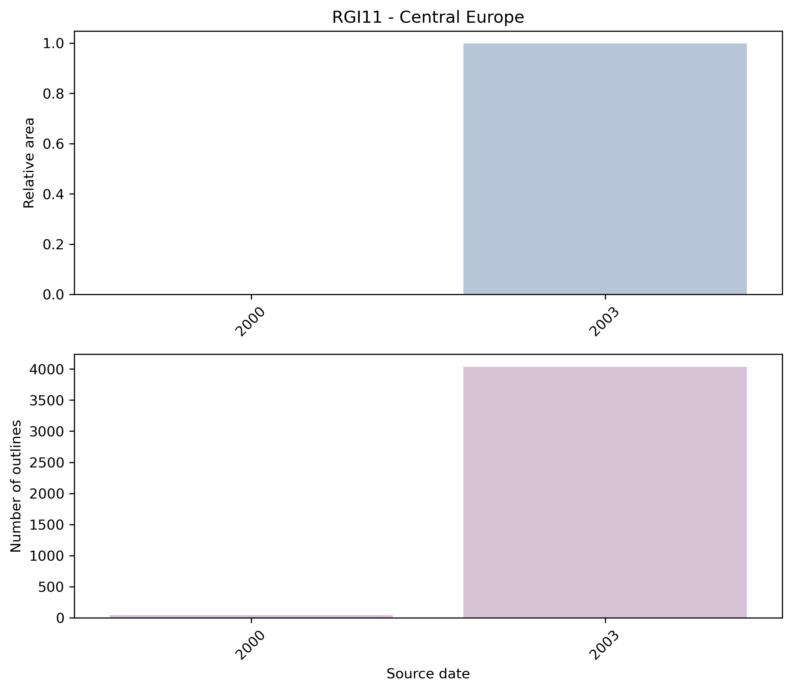
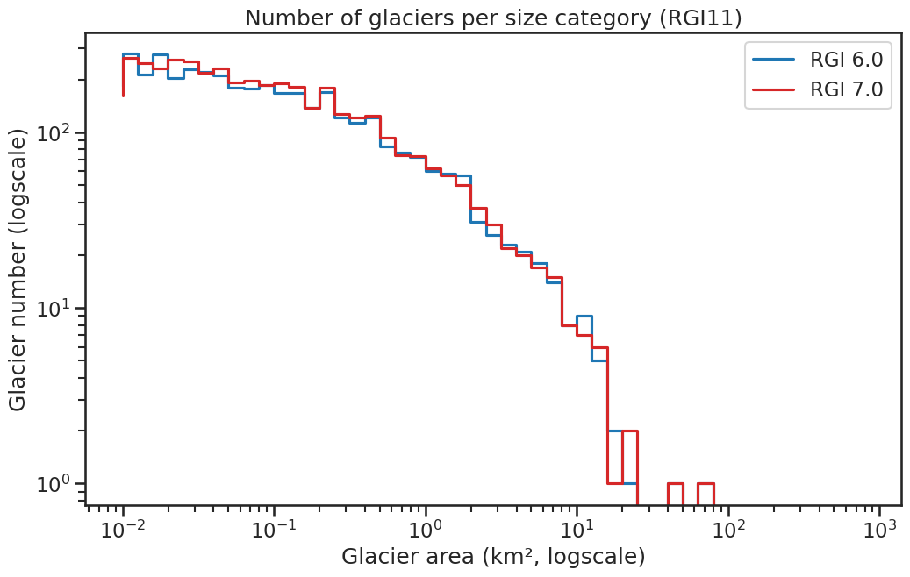

# 11: Central Europe

The region encompasses all glaciers in Europe outside Scandinavia (region 08). More than 99% of the glacier area is located in the European Alps and the Pyrenees. The term "Central Europe " has been chosen to differentiate this glacier region from the one in northern Europe (region `08`, Scandinavia), fully aware that the geographical extent is commonly different when used in other contexts.

```{admonition} Subregions
:class: note, dropdown

- 11-01: Alps
- 11-02: Southeast Europe

```

<!--- Map start -->

:::{figure-md}


Regional glacier area.
[Download high resolution version](https://raw.githubusercontent.com/GLIMS-RGI/rgi_user_guide/main/docs/img/region_plots/RGI11/isrgi6_map.jpeg).
:::

<!--- Map end -->

## Changes from version 6.0 to 7.0

**European Alps**

The RGI 6.0 outlines from 2003 were revised due to missing glaciers (in particular in the Dolomites), wrongly mapped debris-covered glaciers, errors in geolocation (Maritime Alps) and topology issues such as overlapping outlines (Mt. Blanc region). For the corrections we used the same Landsat 5 TM images as for the inventory adopted in the RGI 6.0 {cite:p}`Paul2011a`, glacier outlines and Sentinel-2 images from the inventory by {cite:p}`Paul2020`, and very high-resolution images from the "World imagery" layer of the ESRI Basemap. The entire region is shown as "new" on the map, but we estimate that only about 1/5 of the outlines changed. 

**Pyrenees**

In the Pyrenees, outlines were replaced by an updated inventory by Eñaut Izagirre using Landsat 7 ETM+ imagery from August and September 2000. The updated inventory is based on an earlier inventory from 1984 {cite:p}`Serrat1993`. Due to the very small size of these glaciers, the manual delineation of the outlines was supported by the use of high-resolution aerial orthophotos taken by the Spanish National Geographic Institute in September 1999 and July 2000.

**Other regions**

Three glaciers in Montenegro, Albania, as well as the Calderone glacier (Italy) previously included in the RGI 6.0 [are no longer available in RGI 7.0](https://github.com/GLIMS-RGI/rgi7_scripts/issues/27) since they were not in GLIMS (see "Version history" below for more details about these glaciers).


## Additional information 

```{admonition} Data sources and analysts
:class: important, dropdown

:::{figure-md}


Submission IDs used for this region
[Download high resolution version](https://raw.githubusercontent.com/GLIMS-RGI/rgi_user_guide/main/docs/img/region_plots/RGI11/inventory_map.jpeg).
:::

**Glacier outline providers to GLIMS**

*This list includes the providers of the outlines used in the RGI 7.0 as generated automatically from the GLIMS outlines metadata. We acknowledge that the list may be incomplete due to omissions in the GLIMS database.*

Submission 715
: **Submitter**: Izagirre, Eñaut.<br/>**Number of outlines**: 45. **Area**: 4.2km². **Release date**: 2020-05-27.<br/>**Analysts**: Izagirre, Eñaut.

Submission 731
: **Submitter**: Paul, Frank.<br/>**Number of outlines**: 4034. **Area**: 2120.1km². **Release date**: 2021-10-09.<br/>**Analysts**: Frey, Holger; Le Bris, Raymond; Paul, Frank; Rastner, Philipp.

Reviewers
: Huss, Matthias; Rabatel, Antoine;

```

````{admonition} Regional statistics
:class: seealso, dropdown

```{card} Figure: Outlines source date

:::{figure-md}


Distribution of the outline dates per area (top) and number (bottom)
:::

```

```{card} Figure: Glacier area histogram

:::{figure-md}


Number of glaciers per size category (log-log scale).
:::

```

```{card} Table: Terminus type statistics

Regional number of glaciers (N) and area (km²) per terminus type in RGI 7.0 and RGI 6.0. Note that the default designation in RGI 7.0 is now "Not assigned", while in RGI 6.0 lake-terminating glaciers and shelf-terminating glaciers were identified in some regions. The RGI region 19 is entirely labelled as "Not assigned" in RGI 7.0.

|   Value | Terminus type      |   RGI 7.0 (N) |   RGI 6.0 (N) |   RGI 7.0 (Area) |   RGI 6.0 (Area) |
|--------:|:-------------------|--------------:|--------------:|-----------------:|-----------------:|
|       0 | Land-terminating   |             0 |          3927 |                0 |             2092 |
|       1 | Marine-terminating |             0 |             0 |                0 |                0 |
|       2 | Lake-terminating   |             0 |             0 |                0 |                0 |
|       3 | Shelf-terminating  |             0 |             0 |                0 |                0 |
|       9 | Not assigned       |          4079 |             0 |             2124 |                0 |

```

```{card} Table: Surge type statistics

Regional number of glaciers (N) and area (km²) per surge type attribute in RGI 7.0 and RGI 6.0.

|   Value | Surge type   |   RGI 7.0 (N) |   RGI 6.0 (N) |   RGI 7.0 (Area) |   RGI 6.0 (Area) |
|--------:|:-------------|--------------:|--------------:|-----------------:|-----------------:|
|       0 | No evidence  |          4075 |           107 |             2104 |                8 |
|       1 | Possible     |             2 |             2 |                7 |                7 |
|       2 | Probable     |             0 |             0 |                0 |                0 |
|       3 | Observed     |             2 |             2 |               13 |               13 |
|       9 | Not assigned |             0 |          3816 |                0 |             2064 |

```

````

```{admonition} Version history
:class: note, dropdown

Changes from Version 5.0 to 6.0
: The nominal glaciers in France and Italy, added in version 5.0, were replaced from {cite:t}`Gardent2014` (outlines from 2003) and {cite:t}`Smiraglia2015` (outlines from 2005–2012).

Changes from Version 4.0 to 5.0
: The 108 nominal glaciers in the Pyrenees were replaced by 31 glaciers (representing late 2011) from a recent inventory by Renaud Marti, Université de Toulouse. The location (GLIMSId, CenLon, CenLat) of Gh del Calderone in the Appennines was corrected; its outline was added from a map in {cite:t}`Gellatly1994`. Six glacierets in the Maritime Alps {cite:p}`Gellatly1994b`, two in Slovenia {cite:p}`Cekada2012`, one in Montenegro {cite:p}`Hughes2008` and two in Albania {cite:p}`Milivojevic2008` were added, the outlines being taken from maps in the source publications. Some Balkan ice bodies documented in these sources and in {cite:t}`Grunewald2006` were not assimilated because they were smaller than the RGI threshold of 0.01 km2.<br/>The Bavarian glaciers were added from {cite:t}`Hagg2012`.<br/>51 nominal glaciers in the Maritime and Cottian Alps (France and Italy) and 67 nominal glaciers in the Dolomitic Alps (Italy) were added from WGI-XF {cite:p}`Cogley2009a`.<br/>Links were added to 31 glaciers in the WGMS mass-balance database.

Changes from Version 3.2 to 4.0
: Five exterior GLIMSIds were replaced. Topographic and hypsometric attributes were added.

Changes from Version 3.0 to 3.2
: None.

Changes from Version 2.0 to Version 3.0
: None.

Changes from Version 1.0 to Version 2.0
: 109 glaciers in the Pyrenees, and one in the Apennines, were added as nominal circles from WGI-XF. Together they constitute region 11-02.

Version 1.0
: The glacier outlines for this region are derived from ten Landsat TM images acquired during two months in the summer of 2003 using band-ratio images. Drainage divides for individual glaciers were derived from the void-filled SRTM DEM (from CGIARS) in a resampled version with 60 m spatial resolution. All further details are documented in {cite:t}`Paul2011a`. About 30-50 km2 of glaciers are not mapped, mainly very small glaciers located in Italy (Brenta and Dolomites) and Germany, covered by debris or located under local orographic clouds.

```
