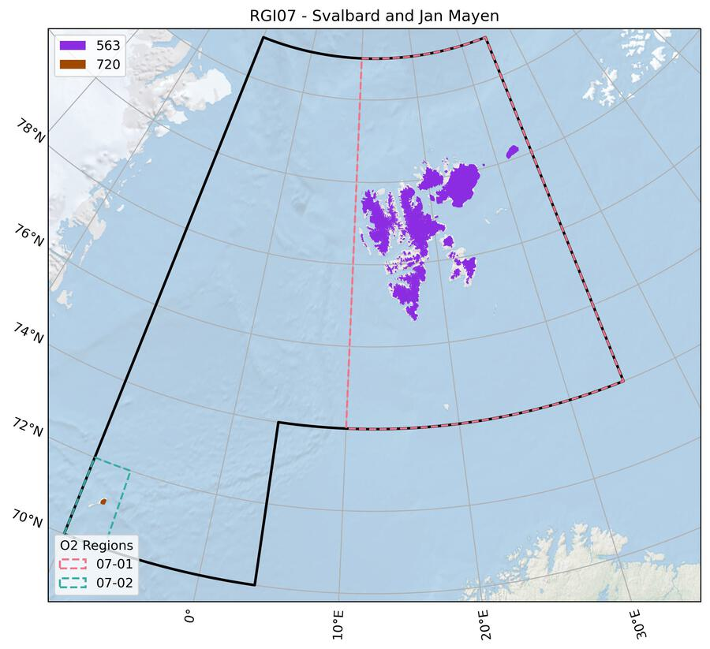
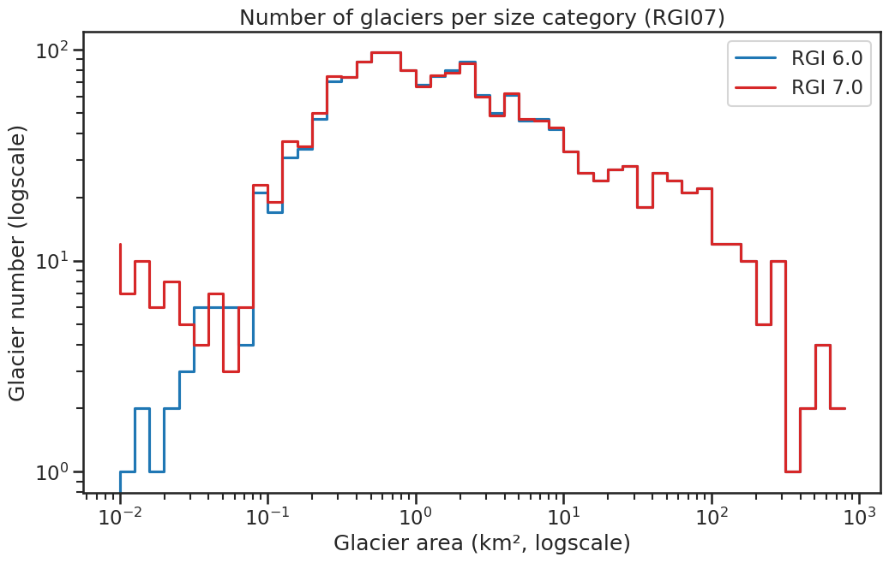

# 07: Svalbard and Jan Mayen

This region encompasses all glaciers in Svalbard and Jan Mayen.

```{admonition} Subregions
:class: note, dropdown

- 07-01: Svalbard
- 07-02: Jan Mayen

```


<!--- Map start -->

:::{figure-md}


Regional glacier area.
[Download high resolution version](https://raw.githubusercontent.com/GLIMS-RGI/rgi_user_guide/main/docs/img/region_plots/RGI07/isrgi6_map.jpeg).
:::

<!--- Map end -->

## Changes from version 6.0 to 7.0

**Jan Mayen**

The RGI 6.0 glacier outlines referred to 1975, and therefore were replaced by new outlines closer to the target year 2000. Outlines were mapped from a Landsat 7 ETM+ scene (217-010) acquired on 13 September 2002 with the band ratio method (panchromatic band divided by the resampled SWIR band) and some manual corrections. New ice divides were derived from a flow direction grid that was calculated from the ArcticDEM (5 m mosaic).


## Additional information 

```{admonition} Data sources and analysts
:class: important, dropdown

:::{figure-md}


Submission IDs used for this region
[Download high resolution version](https://raw.githubusercontent.com/GLIMS-RGI/rgi_user_guide/main/docs/img/region_plots/RGI07/inventory_map.jpeg).
:::

**Glacier outline providers to GLIMS**

*This list includes the providers of the outlines used in the RGI 7.0 as generated automatically from the GLIMS outlines metadata. We acknowledge that the list may be incomplete due to omissions in the GLIMS database.*

Submission 563
: **Submitter**: Koenig, Max.<br/>**Number of outlines**: 1583. **Area**: 33841.4km². **Release date**: 2012-12-04.<br/>**Analysts**: Koenig, Max; Nuth, Chris.

Submission 720
: **Submitter**: Paul, Frank.<br/>**Number of outlines**: 83. **Area**: 117.5km². **Release date**: 2021-08-03.<br/>**Analysts**: Paul, Frank.

Reviewers
: None;

```

````{admonition} Regional statistics
:class: seealso, dropdown

```{card} Figure: Outlines source date

:::{figure-md}


Distribution of the outline dates per area (top) and number (bottom)
:::

```

```{card} Figure: Glacier area histogram

:::{figure-md}


Number of glaciers per size category (log-log scale).
:::

```

```{card} Table: Terminus type statistics

Regional number of glaciers (N) and area (km²) per terminus type in RGI 7.0 and RGI 6.0. Note that the default designation in RGI 7.0 is now "Not assigned", while in RGI 6.0 lake-terminating glaciers and shelf-terminating glaciers were identified in some regions. The RGI region 19 is entirely labelled as "Not assigned" in RGI 7.0.

|   Value | Terminus type      |   RGI 7.0 (N) |   RGI 6.0 (N) |   RGI 7.0 (Area) |   RGI 6.0 (Area) |
|--------:|:-------------------|--------------:|--------------:|-----------------:|-----------------:|
|       0 | Land-terminating   |             0 |          1474 |                0 |            19069 |
|       1 | Marine-terminating |           196 |           141 |            24051 |            14890 |
|       2 | Lake-terminating   |             0 |             0 |                0 |                0 |
|       3 | Shelf-terminating  |             0 |             0 |                0 |                0 |
|       9 | Not assigned       |          1470 |             0 |             9908 |                0 |

```

```{card} Table: Surge type statistics

Regional number of glaciers (N) and area (km²) per surge type attribute in RGI 7.0 and RGI 6.0.

|   Value | Surge type   |   RGI 7.0 (N) |   RGI 6.0 (N) |   RGI 7.0 (Area) |   RGI 6.0 (Area) |
|--------:|:-------------|--------------:|--------------:|-----------------:|-----------------:|
|       0 | No evidence  |          1403 |          1324 |            16656 |            17259 |
|       1 | Possible     |           103 |           103 |             2879 |             3256 |
|       2 | Probable     |            35 |            37 |             2276 |             3581 |
|       3 | Observed     |           125 |           103 |            12148 |             9741 |
|       9 | Not assigned |             0 |            48 |                0 |              121 |

```

````

```{admonition} Version history
:class: note, dropdown

Changes from Version 5.0 to 6.0
: The source for hypsometry was changed from the ASTER GDEM2 to the ViewfinderPanoramas DEM3 (http://www.viewfinderpanoramas.org/).

Changes from Version 4.0 to 5.0
: Links were added to 9 glaciers in the WGMS mass-balance database.

Changes from Version 3.2 to 4.0
: One exterior GLIMSId was replaced. Topographic and hypsometric attributes were added.<br/>In earlier versions, dates were omitted for 119 glaciers (total area 9,770 km2). They have now been restored from the inventory of {cite:t}`Nuth2013`. The new dates were extracted from file `cryoclim_gao_sj_2001-2010.zip`, downloaded from 
https://data.npolar.no/dataset/89f430f8-862f-11e2-8036-00505bad0004. The newly-dated glaciers, RGI40-07.01449 to RGI40-07.01567, were matched on-screen one by one between RGI 4.0 and the Nuth shapefile.

Changes from Version 3.0 to 3.2
: None.

Changes from Version 2.0 to Version 3.0
: None.

Changes from Version 1.0 to Version 2.0
: Outlines of the glaciers on Jan Mayen (07-02) were digitized by J.G. Cogley from {cite:t}`Hagen1993`.

Version 1.0
: The Svalbard inventory is described in more detail by {cite:t}`Nuth2013`.<br/>Three primary data sets are used. The main sources are SPOT5-HRS DEMs and orthoimages provided within the framework of the IPY-SPIRIT (SPOT 5 stereoscopic survey of Polar Ice: Reference Images and Topographies) Project {cite:p}`Korona2009`. The SPOT5-HRS collects 5m panchromatic stereo images that are stereoscopically processed into 40m DEMs, then used to generate the orthoimages. Five SPIRIT scene acquisitions from 2007-2008 cover 71% of the glacier area. The secondary source is 23 scenes from the ASTER sensor in the form of automatically generated DEMs and orthoimages (AST14DMO products downloaded from NASA) covering 16% of the glacier area. Cloud-free scenes are not available for 2007-2008, and therefore data from as early as 2001 are used. For less than 14% of the glacier area, a suitable SPOT5-HRS or ASTER scene was not available. For these glaciers, 11 orthorectified Landsat scenes are used. Furthermore, additional Landsat and ASTER scenes are used to aid digitization decisions about the seasonal snow cover.<br/>The original glacier delineation and glacier identification system is based on the {cite:t}`Hagen1993` atlas, which conforms to WGI standards but is only available as a hard copy. Therefore, digitized national datasets are the base glacier masks from which to begin the inventory {cite:p}`Konig2014`. From this original dataset, we manually re-delineated the individual glacier basins based upon the {cite:t}`Hagen1993` Atlas and updated by trimming the front position and the lateral edges below the ELA. Since the original national dataset was derived by cartographers, many of the mask segments above the ELA contained snow covered valley walls and gullies (not perennially snow covered). These are, to the best of our ability, clipped from the masks by visually analyzing the recent satellite archives of ASTER and Landsat.

```
