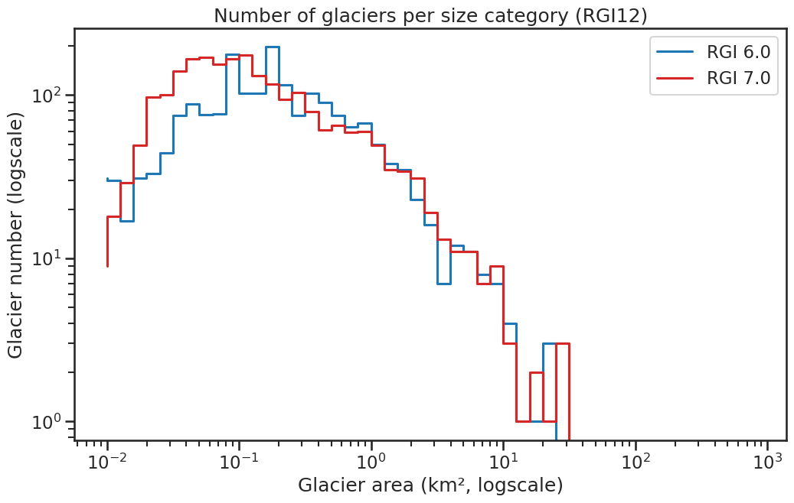

# 12: Caucasus and Middle East

The region encompasses all glaciers between 30°E and 54°E and 30°N and 45°N. More than 99% of the glaciers are located in the Caucasus.

```{admonition} Subregions
:class: note, dropdown

- 12-01: Caucasus and Middle East
- 12-02: Middle East

```

<!--- Map start -->

:::{figure-md}


Regional glacier area.
[Download high resolution version](https://raw.githubusercontent.com/GLIMS-RGI/rgi_user_guide/main/docs/img/region_plots/RGI12/isrgi6_map.jpeg).
:::

<!--- Map end -->

## Changes from version 6.0 to 7.0

All RGI6.0 outlines have been replaced, representing a considerable change and improvement to RGI 6.0. 

**Caucasus**

The RGI 6.0 inventory for the Greater Caucasus, which includes 95% of the region’s glaciers, was based on ASTER and Landsat imagery from 1999–2004 {cite:p}`Khromova2016a`. Since the data set has geolocation issues, and missing glaciers in the eastern and western Greater Caucasus are included as "nominal glaciers" (circles covering an area equivalent to glacier size), the entire data set was replaced in RGI 7.0 by manually digitized outlines from {cite:t}`Tielidze2022` primarily based on Landsat scenes from 1999-2002.

**Middle East**

Most RGI 6.0 glacier outlines were mapped based on ASTER imagery from 2004-2006 (Turkey) and Landsat scenes from 2011 (Iran), however, a closer look revealed that most of these outlines were snow patches and not actual glaciers. Therefore, outlines were remapped based on Landsat imagery from 1998-2001.


## Additional information 

```{admonition} Data sources and analysts
:class: important, dropdown

:::{figure-md}


Submission IDs used for this region
[Download high resolution version](https://raw.githubusercontent.com/GLIMS-RGI/rgi_user_guide/main/docs/img/region_plots/RGI12/inventory_map.jpeg).
:::

**Glacier outline providers to GLIMS**

*This list includes the providers of the outlines used in the RGI 7.0 as generated automatically from the GLIMS outlines metadata. We acknowledge that the list may be incomplete due to omissions in the GLIMS database.*

Submission 762
: **Submitter**: Tielidze, Levan.<br/>**Number of outlines**: 2275. **Area**: 1406.7km². **Release date**: 2021-09-09.<br/>**Analysts**: Tielidze, Levan.

Reviewers
: None;

```

````{admonition} Regional statistics
:class: seealso, dropdown

```{card} Figure: Outlines source date

:::{figure-md}


Distribution of the outline dates per area (top) and number (bottom)
:::

```

```{card} Figure: Glacier area histogram

:::{figure-md}


Number of glaciers per size category (log-log scale).
:::

```

```{card} Table: Terminus type statistics

Regional number of glaciers (N) and area (km²) per terminus type in RGI 7.0 and RGI 6.0. Note that the default designation in RGI 7.0 is now "Not assigned", while in RGI 6.0 lake-terminating glaciers and shelf-terminating glaciers were identified in some regions. The RGI region 19 is entirely labelled as "Not assigned" in RGI 7.0.

|   Value | Terminus type      |   RGI 7.0 (N) |   RGI 6.0 (N) |   RGI 7.0 (Area) |   RGI 6.0 (Area) |
|--------:|:-------------------|--------------:|--------------:|-----------------:|-----------------:|
|       0 | Land-terminating   |             0 |          1888 |                0 |             1307 |
|       1 | Marine-terminating |             0 |             0 |                0 |                0 |
|       2 | Lake-terminating   |             0 |             0 |                0 |                0 |
|       3 | Shelf-terminating  |             0 |             0 |                0 |                0 |
|       9 | Not assigned       |          2275 |             0 |             1407 |                0 |

```

```{card} Table: Surge type statistics

Regional number of glaciers (N) and area (km²) per surge type attribute in RGI 7.0 and RGI 6.0.

|   Value | Surge type   |   RGI 7.0 (N) |   RGI 6.0 (N) |   RGI 7.0 (Area) |   RGI 6.0 (Area) |
|--------:|:-------------|--------------:|--------------:|-----------------:|-----------------:|
|       0 | No evidence  |          2264 |             0 |             1345 |                0 |
|       1 | Possible     |             0 |             0 |                0 |                0 |
|       2 | Probable     |             5 |             4 |               17 |                7 |
|       3 | Observed     |             6 |             3 |               44 |               34 |
|       9 | Not assigned |             0 |          1881 |                0 |             1266 |

```

````

```{admonition} Version history
:class: note, dropdown

Changes from Version 5.0 to 6.0
: The 37 nominal glaciers in Iran, derived from {cite:t}`Moussavi2009`, were replaced by 200 glacier outlines submitted to GLIMS by Neamat Karimi (Ministry of Energy, Teheran).

Changes from Version 4.0 to 5.0
: Links were added to 7 glaciers in the WGMS mass-balance database.

Changes from Version 3.2 to 4.0
: One exterior GLIMSId was replaced. Topographic and hypsometric attributes were added.<br/>As noted by {cite:t}`Shahgedanova2014`, version 3.2 omitted glaciers in the western and eastern Greater Caucasus. These omissions have been partly rectified by adding nominal glaciers from WGI-XF {cite:t}`Cogley2009a`. The 339 added glaciers, with date ranges 1965–1976, cover 155 km2 and also include some in the central Greater Caucasus (on the Svanets and Lechkhum Ranges to the south of the main ridge of the Caucasus) and in the Lesser Caucasus in Armenia.

Changes from Version 3.0 to 3.2
: None.

Changes from Version 2.0 to Version 3.0
: Outlines of the glaciers of Turkey were provided by M.A. Sarıkaya {cite:p}`Sarkaya2014`.

Changes from Version 1.0 to Version 2.0
: The 37 glaciers of Iran (12-02) were added as nominal circles from {cite:t}`Moussavi2009`.The information available for Turkey {cite:p}`Kurter1991` was not adequate for placing the individual glaciers, which have a total area of 22.9 km2.

Version 1.0
: Outlines of glaciers in the Caucasus were obtained from the GLIMS database.

```
