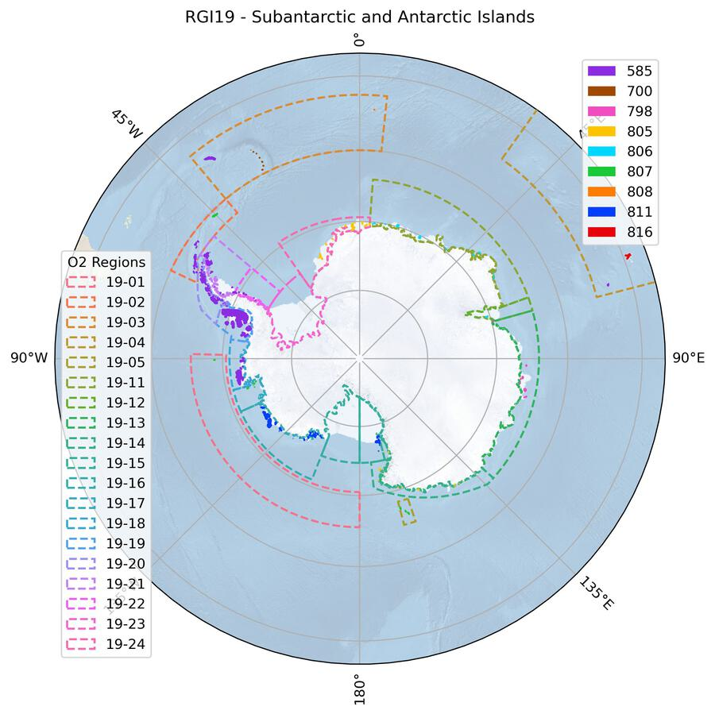

# 19: Subantarctic and Antarctic Islands

The region encompasses all glaciers on the islands in the periphery of mainland Antarctica, except those covered by ice rises within ice shelves. Some remote islands in the Southern ocean are also included. The region does not include glaciers on mainland Antarctica.

```{admonition} Subregions
:class: note, dropdown

- 19-01: Subantarctic (Pacific)
- 19-02: South Shetlands and South Orkney
- 19-03: Subantarctic (Atlantic)
- 19-04: Subantarctic (Indian)
- 19-05: Balleny Islands
- 19-11: E Queen Maud Land 7A
- 19-12: Amery Ice Shelf 7B
- 19-13: Wilkes Land 7C
- 19-14: Victoria Land 7D
- 19-15: Ross Ice Shelf 7E
- 19-16: Marie Byrd Land 7F
- 19-17: Pine Island Bay
- 19-18: Bellingshausen Sea 7H1
- 19-19: Alexander Island 7H2
- 19-20: West Antarctic Peninsula 7I1
- 19-21: Northeast Antarctic Peninsula 7I2
- 19-22: Southeast Antarctic Peninsula 7I3
- 19-23: Ronne-Filchner Ice Shelf 7J
- 19-24: W Queen Maud Land 7K

```

<!--- Map start -->

:::{figure-md}


Regional glacier area.
[Download high resolution version](https://raw.githubusercontent.com/GLIMS-RGI/rgi_user_guide/main/docs/img/region_plots/RGI19/isrgi6_map.jpeg).
:::

<!--- Map end -->

## Changes from version 6.0 to 7.0

Region `19` (previously "Antarctic and Subantarctic") was split into two first-order regions. Region `19` in RGI 7.0 now solely includes the islands in the periphery of Antarctica, and was renamed to "Subantarctic and Antarctic Islands". A new region `20`, ("Antarctic Mainland") was added to encompass the remaining subregion ("Antarctic Ice Sheet", previously `19-31` and now `20-01`).

Most RGI 6.0 outlines originated from {cite:t}`Bliss2013` based on topographical maps from the Antarctic Digital Database {cite:p}`add2000` (see {cite:t}`Bliss2013` for details). For RGI 7.0, glaciers in the following subregions were remapped using satellite imagery from around year 2000, and georeferencing issues were corrected (shifts, deformation, etc. See github discussion [here](https://github.com/GLIMS-RGI/rgi7_scripts/issues/61) and [here](https://github.com/GLIMS-RGI/rgi7_scripts/issues/64)):

- 19-01: Subantarctic (Pacific)
- 19-02: South Shetlands and South Orkney
- 19-03: Subantarctic (Atlantic)
- 19-04: Subantarctic (Indian)
- 19-05: Balleny Islands
- 19-11: E Queen Maud Land 7A
- 19-12: Amery Ice Shelf 7B
- 19-13: Wilkes Land 7C
- 19-14: Victoria Land 7D
- 19-15: Ross Ice Shelf 7E
- 19-16: Marie Byrd Land 7F
- 19-17: Pine Island Bay
- 19-24: W Queen Maud Land 7K

Several wrongly mapped icebergs and other bodies were removed. Some larger ice caps were manually divided into individual glaciers, especially in subregions 19-15 and 19-16. Altogether, glacier area changes between RGI 6.0 and RGI 7.0 are small (+0.1%) but the quality of the inventory has considerably improved.

An important discussion about RGI outlines in region 19 has been triggered by two recent publications: {cite:t}`Millan2022` and {cite:t}`Hock2023`, raising the question whether certain outlines in RGI belong to the ice sheet or the glacier category. We acknowledge the need for discussion and coordination within the scientific community to avoid double counting, but chose not to change the current separation in the RGI without consensus from both the glacier and ice-sheet research communities.

**Kerguelen Islands (second-order region 19-04)**

Glacier outlines in RGI 6.0 were from the 1960s and partly very roughly digitized. 
All outlines were replaced in RGI 7.0 based on a much improved and more recent (year 2001) data set in the GLIMS database (submissions 527 and 528). Since this data set does not include the south-western and northern part of the island, these regions were remapped. As suitable satellite images are not available for this region close to the target year 2000, images from 2010 (Landsat 7) and 2018 (Landsat 8) in the north, and images from 2018 (Landsat 8) and 2022 (Sentinel-2) in the southwest were used to map the glaciers. Furthermore, some missing smaller glaciers in the south-east of the main ice cap were added and some of the existing outlines were corrected. The "World imagery" layer of the ESRI Basemap was locally used to aid in the interpretation. The AW3D30 DEM was used to derive a flow direction grid and correct ice divides. 

**Attributes**

RGI 6.0 included for each glacier a label for the terminus type attribute (`term_type`). However, in RGI 7.0 all glaciers received the label `Not assigned`, despite the prevalence of marine and shelf-terminating glaciers in this region. Updating this attribute is planned for the next version of the RGI.

## Additional information 

```{admonition} Data sources and analysts
:class: important, dropdown

:::{figure-md}


Submission IDs used for this region
[Download high resolution version](https://raw.githubusercontent.com/GLIMS-RGI/rgi_user_guide/main/docs/img/region_plots/RGI19/inventory_map.jpeg).
:::

**Glacier outline providers to GLIMS**

*This list includes the providers of the outlines used in the RGI 7.0 as generated automatically from the GLIMS outlines metadata. We acknowledge that the list may be incomplete due to omissions in the GLIMS database.*

Submission 585
: **Submitter**: Bliss, Andrew.<br/>**Number of outlines**: 1759. **Area**: 98180.0km². **Release date**: 2015-07-01.<br/>**Analysts**: Berthier, Etienne; Bliss, Andrew; Cogley, Graham; LeBris, Raymond; Paul, Frank.

Submission 700
: **Submitter**: Hidalgo, Lidia Ferri.<br/>**Number of outlines**: 31. **Area**: 242.8km². **Release date**: 2018-09-04.<br/>**Analysts**: Castro, Mariano; Gargantini, Hernán; Gimenez, Melisa; Hidalgo, Lidia Ferri; Masiokas, Mariano; Pecker Marcosig, Ivanna; Pitte, Pierre; Ruiz, Lucas; Zalazar, Laura.

Submission 798
: **Submitter**: Berthier, Etienne.<br/>**Number of outlines**: 7. **Area**: 2684.6km². **Release date**: 2022-10-01.<br/>**Analysts**: Berthier, Etienne; Lebreton, Jerome.

Submission 805
: **Submitter**: McNabb, Robert.<br/>**Number of outlines**: 68. **Area**: 6529.7km². **Release date**: 2022-10-01.<br/>**Analysts**: McNabb, Robert.

Submission 806
: **Submitter**: McNabb, Robert.<br/>**Number of outlines**: 23. **Area**: 2985.6km². **Release date**: 2022-10-01.<br/>**Analysts**: McNabb, Robert.

Submission 807
: **Submitter**: Kochtitzky, William.<br/>**Number of outlines**: 212. **Area**: 1656.7km². **Release date**: 2022-11-11.<br/>**Analysts**: Cha, Leo; Gould, Luke; Kochtitzky, William; Merrill, Paige-Marie.

Submission 808
: **Submitter**: Kochtitzky, William.<br/>**Number of outlines**: 11. **Area**: 43.5km². **Release date**: 2022-12-15.<br/>**Analysts**: Kochtitzky, William.

Submission 811
: **Submitter**: McNabb, Robert.<br/>**Number of outlines**: 174. **Area**: 20568.3km². **Release date**: 2022-10-01.<br/>**Analysts**: McNabb, Robert.

Submission 816
: **Submitter**: Paul, Frank.<br/>**Number of outlines**: 457. **Area**: 541.4km². **Release date**: 2023-03-01.<br/>**Analysts**: Mabileau, Laure; Paul, Frank; Rastner, Philipp.

Reviewers
: Berthier, Etienne; McNabb, Robert; Kochtitzky, William;


```

````{admonition} Regional statistics
:class: seealso, dropdown

```{card} Figure: Outlines source date

:::{figure-md}


Distribution of the outline dates per area (top) and number (bottom)
:::

```

```{card} Figure: Glacier area histogram

:::{figure-md}


Number of glaciers per size category (log-log scale).
:::

```

```{card} Table: Terminus type statistics

Regional number of glaciers (N) and area (km²) per terminus type in RGI 7.0 and RGI 6.0. Note that the default designation in RGI 7.0 is now "Not assigned", while in RGI 6.0 lake-terminating glaciers and shelf-terminating glaciers were identified in some regions. The RGI region 19 is entirely labelled as "Not assigned" in RGI 7.0.

|   Value | Terminus type      |   RGI 7.0 (N) |   RGI 6.0 (N) |   RGI 7.0 (Area) |   RGI 6.0 (Area) |
|--------:|:-------------------|--------------:|--------------:|-----------------:|-----------------:|
|       0 | Land-terminating   |             0 |          1231 |                0 |             1360 |
|       1 | Marine-terminating |             0 |          1339 |                0 |            48053 |
|       2 | Lake-terminating   |             0 |            17 |                0 |              316 |
|       3 | Shelf-terminating  |             0 |           165 |                0 |            83138 |
|       9 | Not assigned       |          2742 |             0 |           133432 |                0 |

```

```{card} Table: Surge type statistics

Regional number of glaciers (N) and area (km²) per surge type attribute in RGI 7.0 and RGI 6.0.

|   Value | Surge type   |   RGI 7.0 (N) |   RGI 6.0 (N) |   RGI 7.0 (Area) |   RGI 6.0 (Area) |
|--------:|:-------------|--------------:|--------------:|-----------------:|-----------------:|
|       0 | No evidence  |          2742 |             0 |           133432 |                0 |
|       1 | Possible     |             0 |             0 |                0 |                0 |
|       2 | Probable     |             0 |             0 |                0 |                0 |
|       3 | Observed     |             0 |             0 |                0 |                0 |
|       9 | Not assigned |             0 |          2752 |                0 |           132867 |

```

````

```{admonition} Version history
:class: note, dropdown

Changes from Version 5.0 to 6.0
: None.

Changes from Version 4.0 to 5.0
: Links were added to 2 glaciers in the WGMS mass-balance database.

Changes from Version 3.2 to Version 4.0
: Two exterior GLIMSIds were replaced. Topographic and hypsometric attributes (section 3.2) were added.<br/>The main source for RGI region 19 was the Antarctic Digital Database ADD {cite:p}`add2000`, compiled for glaciological purposes by {cite:t}`Bliss2013`. In RGI 3.2, 34,041 km2 of Antarctic glaciers had dates and 47,961 km2 had date ranges. Most of these were obtained from attributes of coastal and other line segments in the ADD. Of the remaining 50,866 km2 of glaciers, it was possible to recover dates and date ranges for 35,148 km2 from chapter 5 (Bibliography) of the ADD manual {cite:p}`add2000`. This bibliography gives detailed summaries of ADD revisions organized by the tiles into which the database is subdivided, and further by the 16 maps into which each tile is subdivided. For many tiles, but not all, the bibliography lists source images and their dates. Unfortunately the bibliography has not been updated since 2000, and so there is some doubt about the assignment of dates. Often, however, it was possible to verify, for example by inspecting Google Earth, that there have been no perceptible revisions in recent years.

Changes from Version 2.0 to Version 3.2
: None.

Changes from Version 2.0 to Version 3.0
: The TerminusType character of the GlacType attribute was coded following {cite:t}`Paul2009`, with the addition of code 5 for shelf-terminating glaciers. Classification was done visually using imagery from a variety of sources. In a few instances, more than one terminus type applied to a particular glacier. Each such glacier was assigned the code representing the longest part of its perimeter.

Changes from Version 1.0 to Version 2.0
: The ice cover of Peter the First Island in the Bellingshausen Sea was taken from the ADD in version 1.0. In version 2.0 it is replaced by the outlines of 26 glaciers from an inventory by J.G. Cogley {cite:p}`Cogley2014`.

Version 1.0
: Outlines of glacier complexes on islands peripheral to the mainland of Antarctica were obtained from the Antarctic Digital Database (ADD Consortium, 2000). A. Bliss manually classified the ADD’s “land” polygons into continent, ice rise, ice cap, and glacier-complex polygons. Ice rises, and ice bodies on the continental mainland, are not included in this inventory. Nor are ice shelves. The classification was based on the surface morphology and surface flow velocities observed in data from Landsat, the RADARSAT Antarctic Mapping Project DEM, and the MEaSUREs InSAR-based Antarctic Velocity Map. On islands with prominent nunataks, glacier complexes were subdivided into individual glaciers following {cite:t}`Kienholz2013`. More details on the processing of these outlines are given by {cite:t}`Bliss2013`.<br/>Outlines of glaciers on most of the Subantarctic islands were obtained by E. Berthier and J.G. Cogley from various sources including satellite imagery and maps {cite:p}`Cogley2014`. For King George Island in the South Shetland Islands, outlines were downloaded from KGIS, the King George Island Geographic Information System, a now defunct web site created by F. Rau and S. Vogt, University of Freiburg. Separate outlines of “glacier basins” and ice-free areas were harmonized and merged to form glacier outlines containing nunataks. For Kerguelen, outlines are from {cite:t}`Berthier2009`. <br/>Outlines of South Georgia glaciers were mapped by F. Paul from a Landsat ETM+ scene from 2003 using a band 3/5 ratio and manual corrections for icebergs and water (removed), and debris-cover (added); some regions covered by seasonal snow might be included.

```
